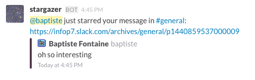
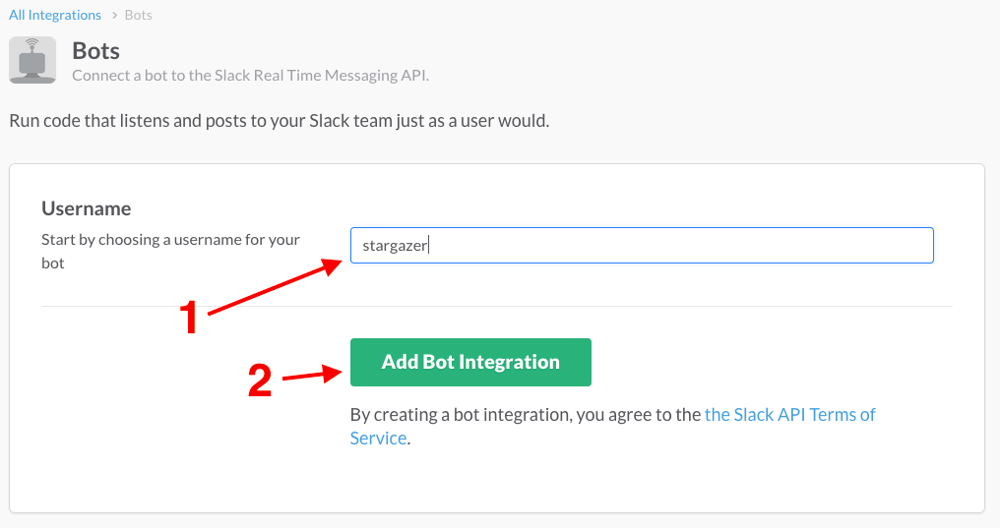
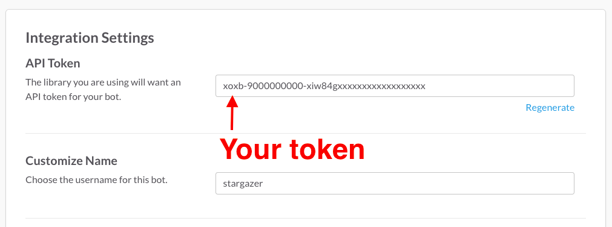
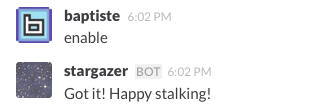

# Stargazer

**Stargazer** is a Slack bot that watch for stars on your messages and report
them to you.

## Build

    go get github.com/bfontaine/stargazer

## Run

    $ TOKEN=your-slack-token stargazer

## FAQ

### How do I get a token?

1. Go on your team’s Slack URL, and on the “Integrations” page, search for the
   “bots” integration. If your team is e.g. `foobar`, the URL is
   `https://foobar.slack.com/services/new/bot`.
2. Choose a name for your bot. Don’t worry, you can change it later.
   
3. Your token is on the bot page.
   

## How do I get the bot to report stars to me?

The bot works with a whitelist, not to annoy everybody by default. Send it a
private message saying “enable”, and it should enable the reporting for you.

You can later disable this by sending it “disable”.

## Hacking

**Stargazer** doesn’t currently have a public API. You can however contribute
to this repository :)

Make sure tests pass with the following command:

    $ STARGAZER_TESTING=1 go test ./...
